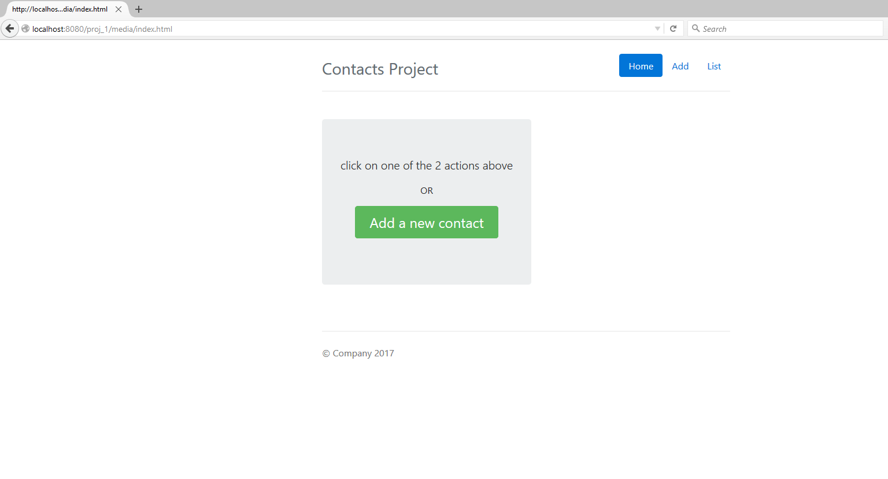
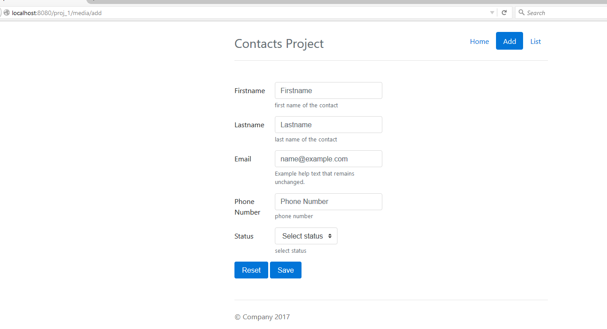
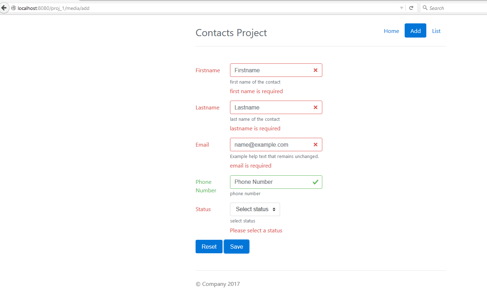
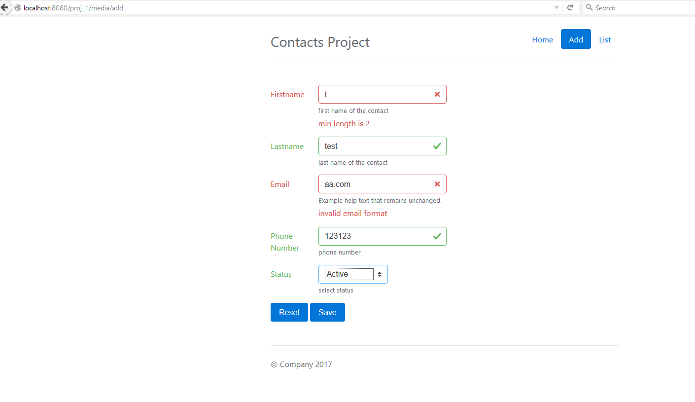
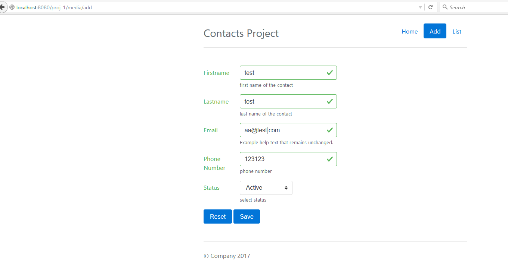
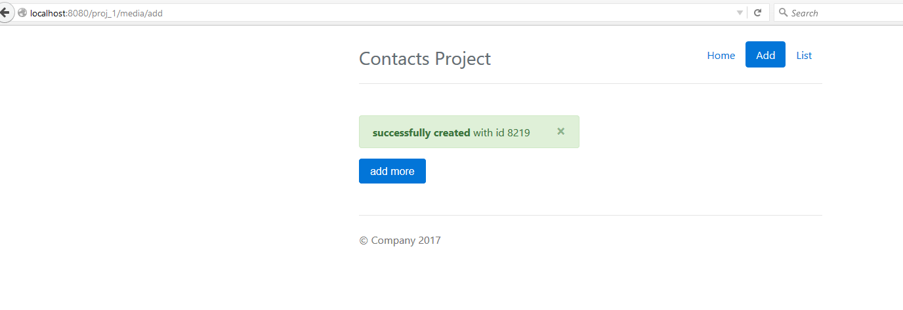
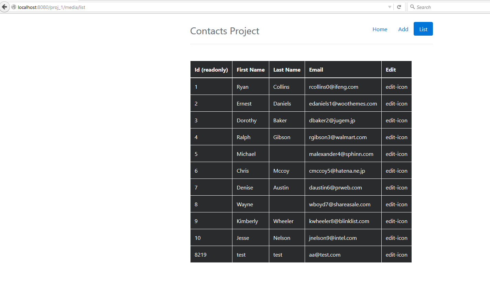
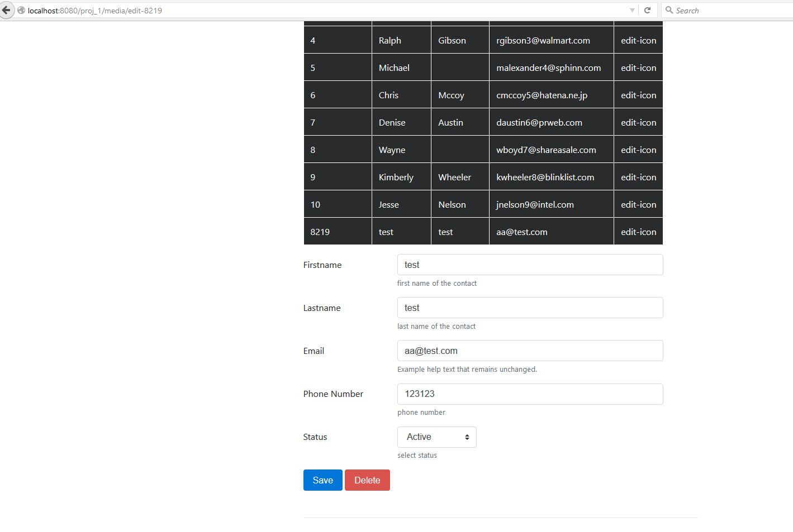
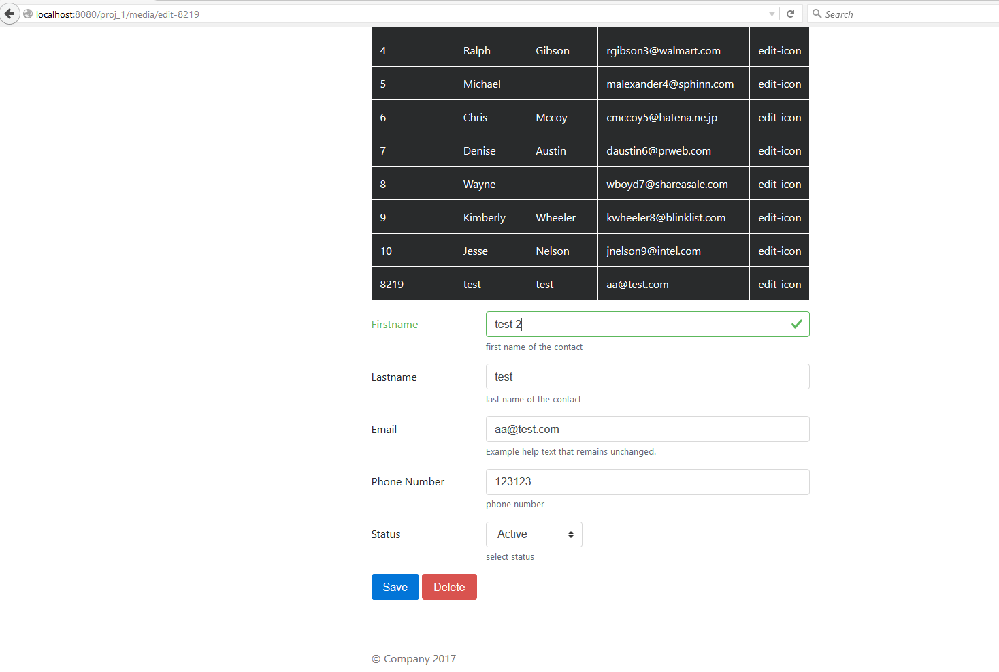
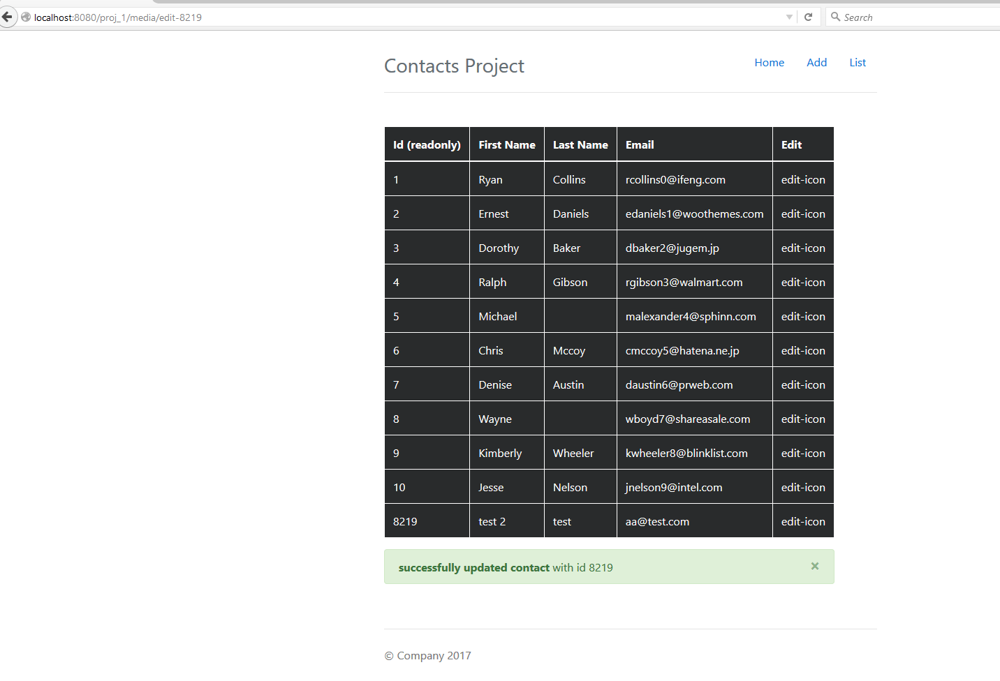

# contact-application
This production ready application has contact information which can be edited, deleted and updated according to the user.

## Angular app under [WebContent/Media](WebContent/media) folder.

## source file paths

### java api file paths 
* [rest api file](src/proj_1/web/rest/ContactsRestService.java)
* model files [contact](src/proj_1/web/model/Contact.java) [status](src/proj_1/web/model/Status.java)
* [database access file](src/proj_1/web/db/ContactsDB.java)
### UI file paths
* [main ui file](WebContent/media/index.html)
* angular directives, controllers and services are located [here](WebContent/media/scripts)

## project flow
----
* [index.html](WebContent/media/index.html) file contains the main layout
    * this is a static file served directly from the file system
    * this file would load all the angular, bootstrap libraries necessary 
    * this file also loads the main angular app settings file, main contacts service, directives and controllers 
* [angular app settings file](WebContent/media/scripts/angular.main.js) file contains the code to create an angular app, setup routes and also the sites main controller which handles page titles etc ..
* the default state that matches with the url index.html is called Home, which would loads the file [default.html](WebContent/media/default.html), this file is just a descriptive file that has a simple button that will route to Add state
* clicking on the Add a new Contact button will change UI Route state to Add, which will load 
    * [add.html](WebContent/media/add.html) this will inturn load the controller 
    * AddContactController from the file [add.contact.controller.js](WebContent/media/scripts/controllers/add.contact.controller.js) and the directive 
    * createUpdateContact from the file [directive.js](WebContent/media/scripts/directives/add_edit_contact/directive.js)
    * the template content for the directive is in the file [template.html](WebContent/media/scripts/directives/add_edit_contact/template.html)
* the directive createUpadteContact contains the code to either create a blank form if no id is provided to it, or fetch the contents of the Contact from the API and create a form with the data from the API, it will also decide to weather call the add or update api based on this, and also weather to display delete or reset form buttons
* on clicking the add button from the add.html page, this will call the addContact method in the ContactsMainService from the file [contacts.data.service.js](WebContent/media/scripts/services/contacts.data.service.js), the service will return a $http promise, which will make a http post call to /proj_1/api/addcontact
* the directive in turn calls the method on AddContactController based on the response from the Service, which display alert on the page
* on clicking the list from the main nav bar, the state will change to List, which load the file edit.html and the controller UpdateContactController from the file [update.contact.controller.js](WebContent/media/scripts/controllers/update.contact.controller.js) and the directive contactsList from the file [directive.js](WebContent/media/scripts/directives/contacts_list/directive.js) 
* the directive contactsList will make a call the ContactsMainService to get the list of contacts data from the API and use the template.html file from the same folder to display the content
* on click edit link from the contacts list, the state will change to Edit-{id}, this will load the same files for contacts list, but with an additional parameter that instructs the UpadContactController to create the directive createUpadteContact
* the createUpdateContact directive will call the api /proj_1/api/getcontact/ to get contact details and display the form with data in it, the same validations that are performed to add a contact are performed while updating the contact, as the angular form and the directive file is the same
* on clicking delete the api /proj_1/api/deletecontact is called from the service [ContactsMainService](WebContent/media/scripts/services/contacts.data.service.js)
* on click update the api /proj_1/api/updatecontact is called the service [ContactsMainService](WebContent/media/scripts/services/contacts.data.service.js)

## screenshots

1. index page

2. add contact

3. add contact validation

4. add contact validation

5. add contact validation

6. add contact success message

7. contacts list

8 edit contact page

9 edit contact validation

10 update contact success message

